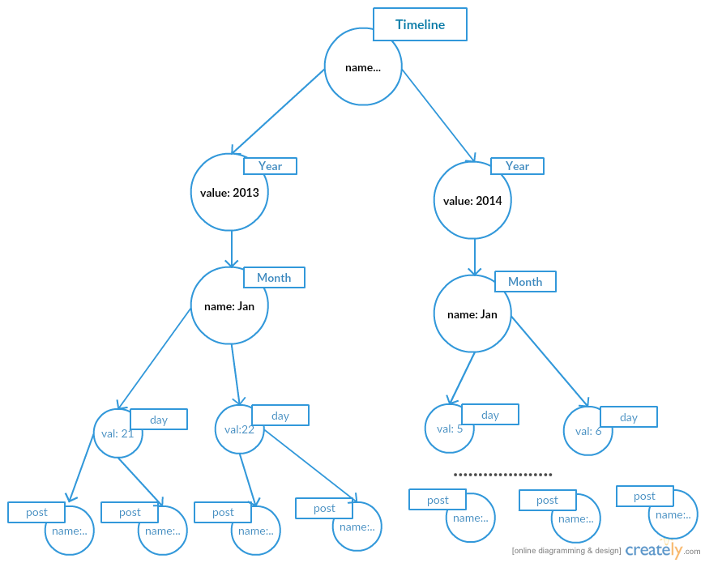

> This is an extract of my inclass presentations of Z604:Big Data Analytics for Web and Text course at [Indiana University, Bloomington](https://www.indiana.edu). Instructor: [Xiaozhong Liu](https://www.ils.indiana.edu/people/profile.html?profile_id=100)

### [Objective:]()

To host a very large and complex data such as the Facebook's friends network graph data. 

Provide efficient data search and access. 

+ A traditional RDBMS model
+ Drawbacks of Relational model
+ A more efficient Graph Data Model
+ Timeline Trees

### [Limitations of Relational Data Model:]()

A typical query in connected data model involves JOIN operations between tables.    
This leads to expensive search computation.

[Image Source](http://neo4j.com/developer/graph-db-vs-rdbms/)
Find more at [Neo4j discussion on Graph DB vs RDBMS](http://neo4j.com/developer/graph-db-vs-rdbms/)
 

### [Graph Relationship Model:]()

#####Why Graph Database?
+ Graph Schema: The best possible abstraction for modeling connectedness.
+ Data model that evolves in step with the iterative and incremental development.
          - Rewritable Schema: Can add nodes and relationships dynamically
                                                 
+ Answers by traversing (querying) the graph rather than resorting to latent map-reduce computations.
+ Memory use or Latency of a query with a join is obliterated 
+ Average Speed of Graph Database
          - 4 million nodes/ sec! 
+ Geared towards Pattern Mining – the search queries natively look for patterns.
  Eg. It searches Common Friends based on common profile properties such as
                            - Location
                            - Education
                            - Work etc. 

### [Graph Schema Entities:]()

#####Node 
+ Node is an entity bag/object containing attributes 
               {eg. – name, age, location etc. }
+ Relationship is a named & directed entity that produce a schematic structure
+ It can have properties like strength/weight, cardinality 
+ Weights in relationships are used for shortest path traversals 
 

### Labeled property graph[(neo4j)]()

Labels in property graph facilitate defining & finding patterns using ASCII –Art & deriving instances that contain a path expression
                (person)-[:LIKE]->(thing) 

Similar objects can contain different set of properties in a Labeled property graph!

### [Timeline Trees:]()

To search posts/events over a specific period of time.

