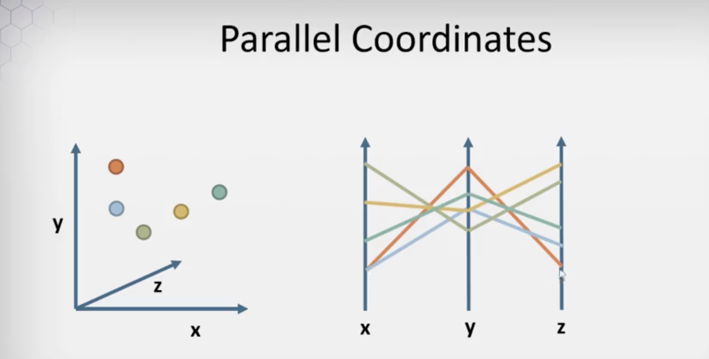
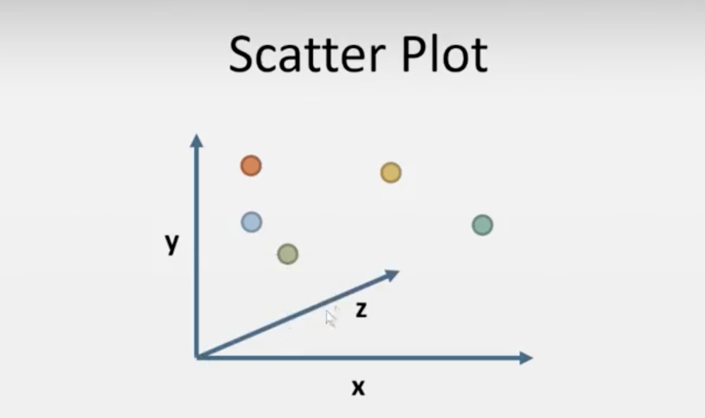

 

> This is an extract from Data Visualization course discussions at [DViz by UIUC](https://www.coursera.org/learn/datavisualization/lecture/phyRg/week-2-introduction).

### [Why parallel coordinates:]()
As we add more that 2 coordinates to any data representation we are going to face problems on a perceptual standpoint, since the essential representation medium itself is a 2D. 

So  Al Inselberg demonstrated the concept of parallel coordinates in the early 90s. Here is how it works. 

 

### [Nuts & Bolts:]()
With parallel coordinates, we're going to take the Cartesian coordinates. We have a horizontal x-axis and a vertical y-axis, and we're going to take these axes and we're going to make them parallel instead of orthogonal, at right angles, as they usually are. 

 

So now the two axes are not orthogonal. They're parallel to each other and they don't extend from the same origin. So the origin here is horizontally at the bottom and increasing x goes up this axis, increasing y goes up this axis. So now I've got the data points, and I need to figure out where these data points occur. 

 

We can map each point onto its corresponding position on the y-axis & its just basically dragging them across horizontally, because their position in y in this chart corresponds to their height along this y-axis. 
